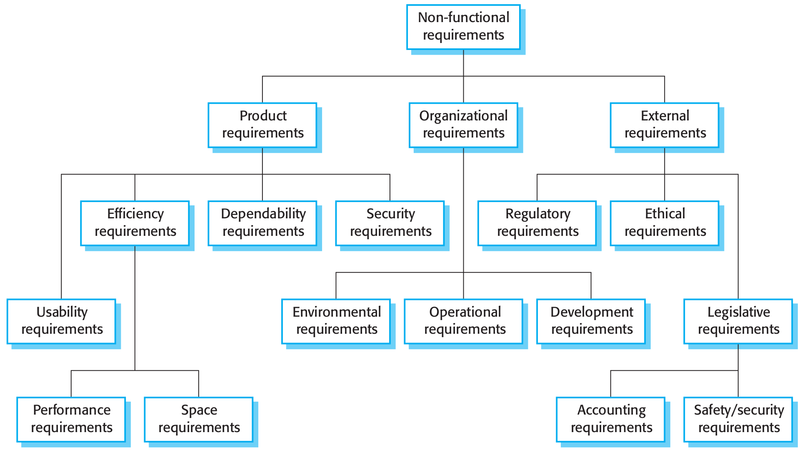
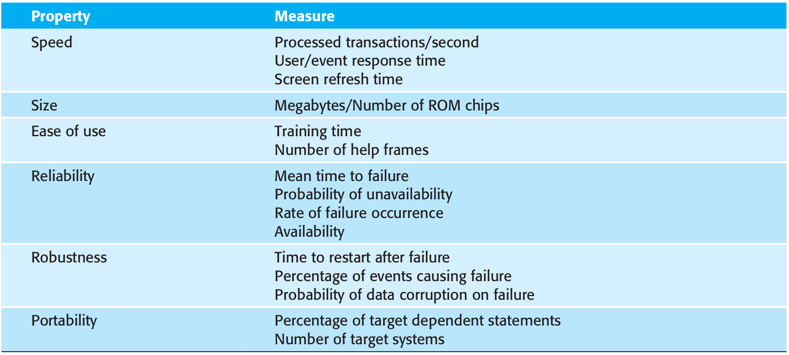
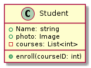
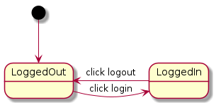
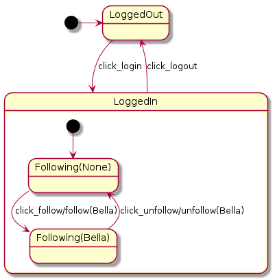
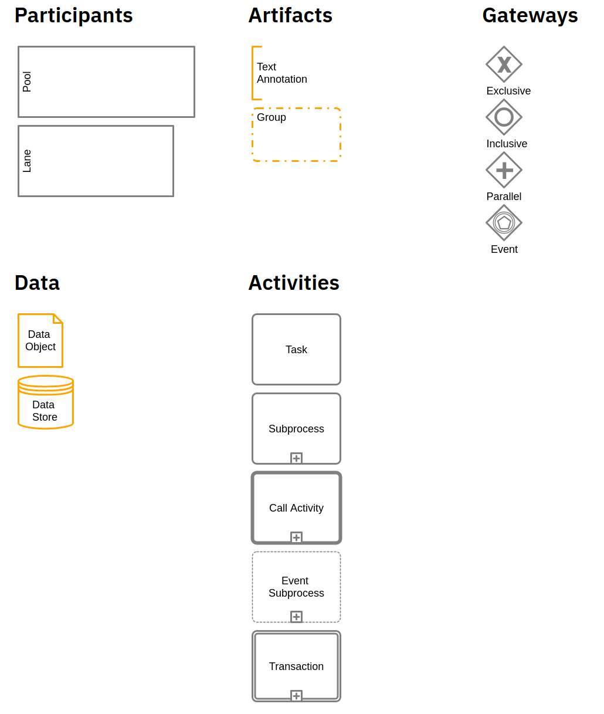

# **Analysis, Design and Software Architecture (BDSA)**
Session 11
[Helge Pfeiffer, Associate Professor](ropf@itu.dk)


## Plan for today

- First hour: Guest Lecture on GDPR and "Privacy by Design"
- Second hour: Requirements Engineering
- Third hour: Structural and Behavioral Modeling
- Fourth hour: Intro to UI Testing.

<!-- First hour -->


## Guest Lecture: GDPR and "Privacy by Design"

We start the lecture with a guest lecture.


Jakob Krabbe Sørensen from [ComplyCloud](https://www.complycloud.com/) will give a guest lecture on "Privacy by Design" and why GDPR matters to you as software engineers.


<!-- Second hour -->

## Task: Privacy by Design?

<!--
_backgroundImage: "linear-gradient(to bottom, #67b8e3, #0288d1)"
_color: white
_header: 10 minutes
-->

- What precisely do you know about your users?
- Where do you have to check?
* Inspect your data model, i.e., all entities on what you store about your users.
  * Is there somewhere else to check?
* With a database browser, investigate what your database really contains about users.

## Why do we have to care about GDPR at all?

## Functional vs. Non-functional requirements

> * _Functional requirements_ These are statements of services the system should provide, how the system should react to particular inputs, and how the system should behave in particular situations. In some cases, the functional requirements may also explicitly state what the system should not do.
> * _Non-functional requirements_ These are constraints on the services or functions offered by the system. They include timing constraints, constraints on the development process, and constraints imposed by standards. Non-functional requirements often apply to the system as a whole rather than individual system features or services.<font size=3>
Source: I. Sommerville <i>Software Engineering</i>
</font>


## Requirements more formally

  > **requirement**
  >
  > statement which translates or expresses a need and its associated constraints (3.1.7) and conditions (3.1.6)
  >
  > Note 1 to entry: Requirements exist at different levels in the system structure.
  >
  > Note 2 to entry: A requirement is an expression of one or more particular needs in a very specific, precise and unambiguous manner.
  >
  > Note 3 to entry: A requirement always relates to a system, software or service, or other item of interest.<font size=3>
Source: <a href="https://www.iso.org/obp/ui/#iso:std:iso-iec-ieee:29148:ed-2:v1:en">ISO/IEC/IEEE 29148:2018(en) Systems and software engineering — Life cycle processes — Requirements engineering</a>
</font>

  > **software requirements specification (SRS)**. (1) documentation of the essential requirements (functions, performance, design constraints, and attributes) of the software and its external interfaces<font size=3>
Source: <a href="https://standards.ieee.org/ieee/1012/5609/">IEEE 1012-2016 IEEE Standard for System, Software, and Hardware Verification and Validation, 3.1.29</a>
</font>

## Types of Non-functional Requirements

<font size=3>
Image source: I. Sommerville <i>Software Engineering</i>
</font>

## Metrics for Specifying Non-functional Requirements

<font size=3>
Image source: I. Sommerville <i>Software Engineering</i>
</font>

## Task: What kind of requirement?

<!--
_backgroundImage: "linear-gradient(to bottom, #67b8e3, #0288d1)"
_color: white
_header: 10 minutes
-->

- Read [today's project description](./README_PROJECT.md/#add-feature-users-can-follow-and-unfollow-each-other) for implementing the new un-/follow feature of _Chirp!_.
- Discuss with your neighbors: What kind of requirement is specified there?

- After Jakob's presentation, we realize that the _Chirp!_ application has to be GDPR compliant.
- Discuss with your neighbors: What kind of requirement is this?


<!-- Third hour -->

## UML Class diagrams — Class with Fields

```csharp
public class Student
{
    public string Name;
    public Image photo;
    private List<int> courses;

    public void enroll(int courseID)
    {
        courses.Add(courseID);
    }
}
```




## UML Class diagrams — Inheritance

```csharp
public class Student
{

}
public class GuestStudent : Student
{

}
```


## UML Class diagrams — Associations

<style scoped>
pre {
   font-size: 22px;
}
section {
   font-size: 22px;
}
</style>

```csharp
public class Student
{
    public string Name;
    public Image photo;
    private List<Course> courses;

    public void enroll(Course course)
    {
        courses.Add(course);
    }
}
public class Course
{
    public int Id;
}
```


If you have bi-directional references in your code, then the association becomes just a line, i.e., no arrows, with the names of the respective references at the opposite end of the association.

## Use UML Class diagrams scarcely

For documentation, do not overuse UML class diagrams.

Likely, it is best to use them to illustrate your domain model, i.e., your entities and their relations.

## Task: Entity Diagram

<!--
_backgroundImage: "linear-gradient(to bottom, #67b8e3, #0288d1)"
_color: white
_header: 10 minutes
-->

- Navigate to https://app.diagrams.net/.
- From the UML elements in the bottom left, choose classes, associations, and if necessary inheritance relations.
- Draft an illustrate of the domain model of your _Chirp!_ application.
- Once done, send an image to our Teams chat (all in one thread), so that we can discuss some of the diagrams.


## Design: UML Class diagrams to illustrate Domain model

<!--
_backgroundImage: "linear-gradient(to bottom, #deb887, #d17e12)"
_color: white
-->


- Note, the above is likely not a complete entity diagrams once you decide to implement an un-/follow feature to your systems.


What are alternatives to entity diagrams with UML class diagrams?
* ER diagrams as you saw them in your database class.


## Design: UML Statecharts (State Machines)
<!--
_backgroundImage: "linear-gradient(to bottom, #deb887, #d17e12)"
_color: white
-->

- States can be state of your entire application, of some of its components, etc.
* Below is the state of a user of your application. From a starting state (black dot), a user's state transitions between the two states `LoggedIn` and `LoggedOut`.
  
* Note, likely a state machine diagram does not map directly to code in the same way that the class diagram for your domain model does, at least not for your _Chirp!_ applications.


## Design: Nested UML Statecharts (State Machines)
<!--
_backgroundImage: "linear-gradient(to bottom, #deb887, #d17e12)"
_color: white
-->

  


## UML Activity diagrams

* Initial state
* Activity. Can be anything from what is done in a single method all the way up to long running (even manual) processes.
* Condition (◇)
* Final state


## Design: UML Activity Diagrams
<!--
_backgroundImage: "linear-gradient(to bottom, #deb887, #d17e12)"
_color: white
-->

An example of sequence of activities for sending (sharing) a cheep could look like.
Note, in your implementations, activities might be in a different order or different activities.

Again, activities do likely map to larger parts of your source code, e.g., controller methods in C♯, Razor views, etc.


## UML Activity Diagrams combined with Wireframes

Can be used as screen transition diagrams that may be used during design of user centered flow of screens.

Note, the following is an incomplete activity diagram.


## Task: Activity Diagram

<!--
_backgroundImage: "linear-gradient(to bottom, #67b8e3, #0288d1)"
_color: white
_header: 10 minutes
-->


- Read again [today's project description](./README_PROJECT.md/#add-feature-users-can-follow-and-unfollow-each-other) for implementing the new un-/follow feature of _Chirp!_.
- Navigate to https://app.diagrams.net/.
- From the UML elements in the bottom left, choose activities, conditions, and start and end states.
- Draft an activity diagram that illustrates a sequence of activities when a user is choosing to follow another user.
- Once done, send an image to our Teams chat (all in one thread), so that we can discuss some of the diagrams.


## Illustrating Structure vs. Behavior

What did we do in the previous slides?

- There are two major concerns of a system that you want to illustrate:
  - Structure: UML class diagrams
  - Behavior: UML statecharts, activity diagrams

* Next time we look at other notations

<!-- Fourth hour -->

## Visualizing structure or behavior with your own notations?


Drawback of own notation:
- What is the meaning of note symbols?
- What is the meaning of rounded rectangles?
- What is the meaning of color?
- Separation of concerns/single responsibility? The diagram mixes structural with behavioral concerns?
<font size=3>
Image source: Andrew Lock <i>ASP.NET Core in Action</i>
</font>


## Visualizing structure or behavior with your own notations?
<style scoped>
pre {
   font-size: 20px;
}
section {
   font-size: 20px;
}

</style>
Best practice:
- You have to provide a legend together with your visualization.
- It it has to describe all used symbols and their meaning.




<font size=3>
Image source: <a href="https://camunda.com/bpmn/reference/">BPMN 2.0 Symbol Reference</a>
</font>


## Visualizing structure or behavior with your own notations?

<style scoped>
pre {
   font-size: 20px;
}
section {
   font-size: 20px;
}
</style>

Best practice:
- You have to provide a legend together with your visualization.
- It it has to describe all used symbols and their meaning.


<font size=3>
Image source: <a href="https://www.researchgate.net/publication/271737676_The_design_space_of_multi-language_development_environments">H. Pfeiffer et al. <i>The design space of multi-language development environments</i></a>
</font>


## Demo of non-headless UI tests


## Why do I want to run UI tests?

- You want to test a user journey through your system from A-Z.
- Recall [today's project description](./README_PROJECT.md/#add-feature-users-can-follow-and-unfollow-each-other).
  -The example describes a detailed scenario of what happens and what has to happen when the new user `Anna` logs for the first time onto _Chirp!_, when she send her first cheep, when she follow, `Bella` and `Cheryl`, when she unfollows `Cheryl`.
  - This scenario can be implemented directly into a UI test, to verify that from a user's view, the system behaves a intended.


## UI Testing with Playwright?

- Getting started with Playwright
  ```bash
  dotnet new nunit -n PlaywrightTests
  cd PlaywrightTests
  dotnet add package Microsoft.Playwright.NUnit
  dotnet build
  pwsh bin/Debug/net7.0/playwright.ps1 install
  ```

- The last step installs various browsers and tools to run UI tests.
- (In case the installed browsers are not in the version that Playwright expects, you have to make sure that PowerShell is installed in the right version and with a global scope, see e.g., https://github.com/microsoft/playwright-dotnet/issues/2006)


## UI Testing with Playwright?
<style scoped>
pre {
   font-size: 18px;
}
</style>

```csharp
namespace PlaywrightTests;

[Parallelizable(ParallelScope.Self)]
[TestFixture]
public class Tests : PageTest
{
    [Test]
    public async Task HomepageHasPlaywrightInTitleAndGetStartedLinkLinkingtoTheIntroPage()
    {
        await Page.GotoAsync("https://playwright.dev");

        // Expect a title "to contain" a substring.
        await Expect(Page).ToHaveTitleAsync(new Regex("Playwright"));

        // create a locator
        var getStarted = Page.GetByRole(AriaRole.Link, new() { Name = "Get started" });

        // Expect an attribute "to be strictly equal" to the value.
        await Expect(getStarted).ToHaveAttributeAsync("href", "/docs/intro");

        // Click the get started link.
        await getStarted.ClickAsync();

        // Expects the URL to contain intro.
        await Expect(Page).ToHaveURLAsync(new Regex(".*intro"));
    }
}
```
<font size=3>
Source: <a href="https://playwright.dev/dotnet/docs/intro">Playwright for .NET Getting Started</a>
</font>

## UI Testing with Playwright?

- You do not necessarily have to write all your UI tests from scratch.
- Playwright includes a code generator that allows you to "record" test cases.

```bash
pwsh bin/Debug/net7.0/playwright.ps1 codegen demo.playwright.dev/todomvc
```


<font size=3>
Source and image source: <a href="https://playwright.dev/dotnet/docs/codegen-intro">Playwright for .NET Generating tests</a>
</font>

## UI Testing with Playwright?

- UI testing of a real application with authentication is not easy.
- How could you do, to send authenticated requests to the SUT?
  * Strategy A: In the instrumented browser, before running the test, login to GitHub.
  * Strategy B: as A but semi-automated, see e.g., https://playwright.dev/dotnet/docs/auth. With 2FA on GitHub enabled, you still have to manually enter the 2FA code.
  * Strategy C: Mock a user by writing its claims to the requests.
  * Strategy D: Replace the authentication scheme when starting up the WebApplicationFactory in the test, so that a mocked user is always authenticated, see e.g., https://learn.microsoft.com/en-us/aspnet/core/test/integration-tests?view=aspnetcore-7.0 and https://danieldonbavand.com/2022/06/13/using-playwright-with-the-webapplicationfactory-to-test-a-blazor-application/.
  * ...


## Feedback

<iframe src="http://209.38.208.62/report_razor_apps2.html" width="100%" height=500 scrolling="auto"></iframe>


## Feedback, manual check of each group's _Chirp!_

<style scoped>
section {
   font-size: 15px;
}
</style>

1 no cheepbox for sending (empty div)
2 no cheepbox for sending, no timelines after login GitHub login is on a button, I am searching for a link not a button,
3 down
4 I cannot login with GitHub
5 I cannot login with GitHub
6 I cannot login with GitHub
7 cheepbox shall be on the public and private timelines (above list of cheeps) not on a separate page. Sending of cheeps does not seem to work.
8 GitHub login is on a button, I am searching for a link not a button, login does not seem to complete
9 GitHub login is on a button, I am searching for a link not a button, login does not seem to complete, I am not redirected somewhere on _Chirp!_
10 (+) Sending link redirects to https://localhost:5273
11 down
12 login redirect to https://jwt.ms/
13 No login link, no login with GitHub, no cheepbox
14 +
15 Sending of cheeps does not seem to work. (blank page and not recorded in timeline on reload)
16 I cannot login with GitHub
17 no cheepbox (for some reason I cannot automatically find the login link)
18 it is a textarea with a button, (rest works)
19 down
20 GitHub login is on a button, I am searching for a link not a button, no cheepbox for sending
21 down
22 After sending cheep, it is not displayed in public timeline, only in my private timeline
23 cheepbox shall be on the public and private timelines (above list of cheeps) not on a separate page
24 I cannot login with GitHub
25 I cannot login with GitHub
26 down
27 + textarea, buttons to login and to cheep?


## To be clear, the **Requirement** for authentication is:

<style scoped>
section {
   font-size: 18px;
}
</style>
#### As a user, I have to be able to login with GitHub so that I can send cheeps.

There are multiple ways to perform authentication via third parties (here via GitHub).
The lecture and the book present:
a) ...
b) ...
c) ...

The project task provides a code snippet for the Razor view. It illustrates that there has to be a link that initiates the authentication functionality, which has to contain the text `login` and which is located in the navigation bar.

```html
... Code example from task comes here ...
```

... More description that you deem necessary ...

**Acceptance Criteria**:
- There is a _link_ with text `login` displayed in the navigation bar of _Chirp!_
- If logged into GitHub in another browser window/tab and after clicking the `login` link, a user is authenticated to _Chirp!_.
- After authentication appears a cheepbox above the list of cheeps, see [ticket #XYZ]().
- After authentication, the `login` link in the navigation bar turns into a link to `logout` displaying the text `logout`.


## Intro to project work

- Now on, tasks in project work are formulated more openly.
- That is, you have to _analyze_ what is written there to be able to design a suitable solution and to implement it correctly.

- If the illustration tools that were presented today help you in analyzing project descriptions and designing suitable solutions, then use them.


## What to do now?


- If not done, complete the Tasks (blue slides) from this class
- Check the [reading material](./READING_MATERIAL.md)
- Work on the [project](./README_PROJECT.md)

- <font color="#cecdce">We are done reading chapters from [Andrew Lock _ASP.NET Core in Action, Third Edition_](https://www.manning.com/books/asp-net-core-in-action-third-edition)! </font>
